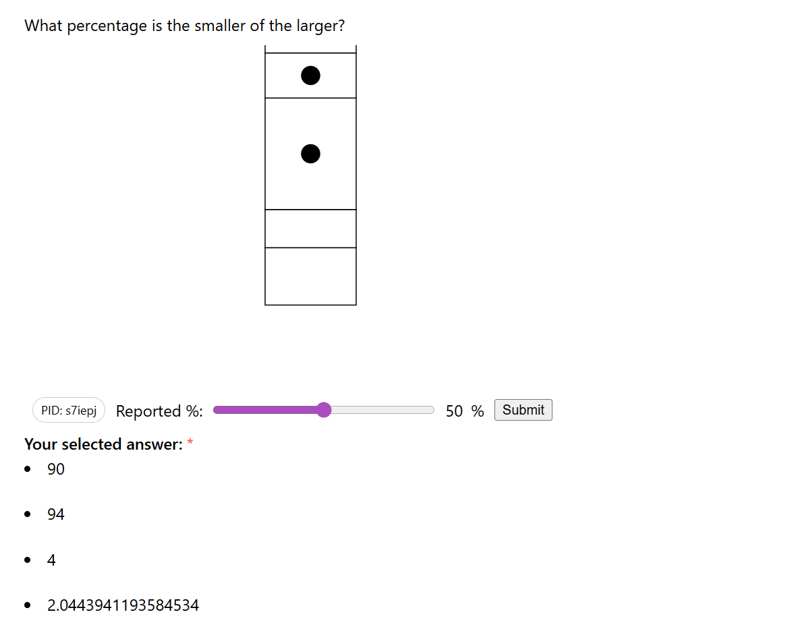
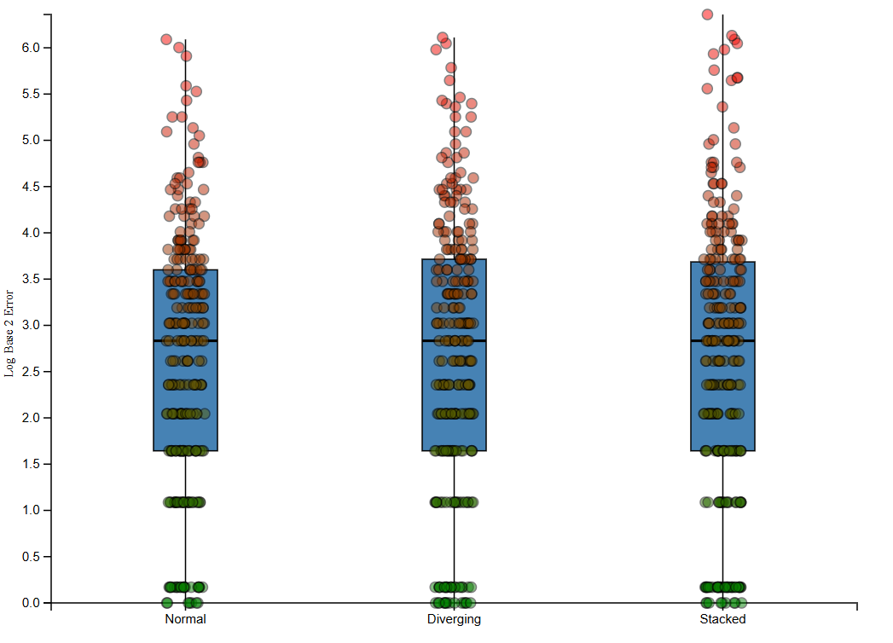

# A3 Experiment

**Team Granite: Max McCalla, Rachel Conca, Elias Montas, and Rohit Tallapragada**

*Experiment Link: https://maxmccalla.github.io/CS4804-ReVisIt/*

*ReVISit Fork: https://github.com/MaxMcCalla/CS4804-ReVisIt*

*Results Visualization: https://rohitt415.github.io/a3-experiment/*

## Introduction

For our project, we wanted to analyze perceptual differences in different styles of bar charts since bar charts are one of the most commonly used methods of data visualization and have many different variations on how they can appear.

Sticking with the general premise of the Cleaveland McGill experiments, we specifically wanted to see if different styles of bar charts impacted subjects' ability to determine the ratios between two differently sized bars. We focused on three different styles of bar charts for this assignment: normal bar chart (where all the bars rest on the x-axis and go upward), diverging bar chart (where all the bars rest on the x-axis but go both up and down), and stacked bar charts (where all the bars are stacked into one bar).

## Setting Up Our Experiment

We decided to use ReVISit for our project as the program is readily available via GitHub and can be confirgured to randomize trials, calculate error and other relevant statistics, and compiling the results into CSV form for easy analysis. We used the D3 library to generate our stimuli (various bar charts) before uploading those to our forked ReVISit repository.

We generated 20 variations of each type of bar chart (normal, diverging, and stacked), randomly marking two of the bars on each. After selecting two of the bars, we calculated what percentage of the larger bar the smaller bar would take up (ex. if the large bar was 5 units and the smaller bar was 3 units, the percentage would be 60% since 3 is 60% of 5).

When completing the experiment, participants would have to move a slider to indicate what percentage of the larger bar the smaller bar would take up. After submitting a response, our program compares the user response to the "true" response and calculates the absolute error and log error of their trial.

## Gathering Data

Once the site was all set up, we hosted our experiment using GitHub Pages and sent it out to various group chats to entice our friends to particpate. Members of the group also did the experiment ourselves for extra data. We weren't able to set up a database to collect responses, so we had each participant download their CSV results to send to a group member who then uploaded them to the `results` folder on the ReVISit repository. In total, we recieved 13 participants who completed our study.

Once all the participants had completed the experiment and sent their results to the group, we compiled them into a single CSV file that we used for analysis.

## Creating the Results Visualization

After compling the data into a single CSV file using Python, we cleaned the data by removing any irrelevant columns and adding a column for the type of chart (normal, diverging, and stacked) before saving that file and importing it into the HTML file to be visualized using D3.

We decided to use parallel box plots to visualize our data since it would be easy to see differences in distributions between the three different types of graphs. We graphed the three box plots next to each other, and added the points from individual trials over the boxplots with a slight jitter to see more individual data as well as the full distributions.

## Analyzing Our Results

Based on the data, there wasn't too much difference in how people perceived differences in sizes between the different styles of bar charts. The median log base 2 error for each of the three styles was basically the same, and the only noticable difference between the three types of charts was in the max values and third quartiles since there was more individual point variation in the upper ranges of errors compared to the lower ranges.

## Possible Limitations

Looking at our experimental design, there were a few things we noticed after running the experiment and analyzing the data that we felt could be improved in later iterations of the experiment. Some participants express confusion in the wording of our question, which may have altered how they responded to the questions and unknowingly altering our data.

Our error was also calculated to be only positive values despite it being possible for participants to either overestimate or underestimate the ratio of the bars. Since the distributions of this iteration were so close together, it may be helpful in the future to have a bidirectional error statistic to account for some more of the variation in the data.

## Technical Achievements

Our project successfully utilized a combination of different softwares to create, run, and analyze an experiment to see perceptual differences in how people judge ratios with different bar chart styles. We used D3 to create all of our visual stimuli, which was then randomized for each participant using ReVISit.

Our analysis used a combination of Python and the D3 library to successfully create an interactive visual of our experiment data that allows users to see potential trends in the overall data while still getting to look at the results from individual trials via a tooltip and boxplot display.

## Design Achievements

Our experiment was designed to be similar to the Cleaveland McGill experiment, with the visual stimuli designed to be as simple as possible to minimize potential variations that may come with complex designs. The interface for the experiment was also kept simple as a slide tool so that people who weren't as familiar with data visualization could complete our experiment with relative ease.

The results were visualized using D3 to create an interactive experience where users had the distribution data displayed along with points from individual trials. The visuals were colored such that the boxplots were colored with simple blue and black lines and rectangles, and the "selected" rectangle the user hovers over would turn orange so that the user knows what information they're looking at. The data points were also colored in red and green, with lower error shaded green (as green usually signifies a positive outcome) and higher error in red (which usually signifies a negative outcome). The tooltip also displays relevant information about the dataset when hovering over a point (giving trial specific data) and over a box (giving distribution specific data). This gives the user more insight into the results of our experiment and allows them to explore the data more than they would if it was just the visual.

## Some Screenshots

### Experiment Screenshot

### Visualization Screenshot

